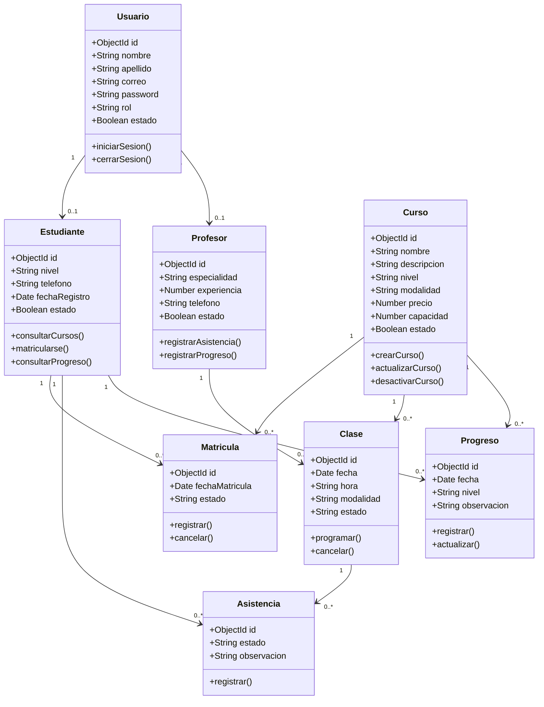

# Diagrama de clases

Copia este código en un editor compatible con Mermaid o úsalo como guía para dibujarlo en draw.io/StarUML.

```mermaid
classDiagram
class Usuario {
 +ObjectId id
 +String nombre
 +String apellido
 +String correo
 +String password
 +String rol
 +Boolean estado
 +iniciarSesion()
 +cerrarSesion()
}

class Estudiante {
 +ObjectId id
 +String nivel
 +String telefono
 +Date fechaRegistro
 +Boolean estado
 +consultarCursos()
 +matricularse()
 +consultarProgreso()
}

class Profesor {
 +ObjectId id
 +String especialidad
 +Number experiencia
 +String telefono
 +Boolean estado
 +registrarAsistencia()
 +registrarProgreso()
}

class Curso {
 +ObjectId id
 +String nombre
 +String descripcion
 +String nivel
 +String modalidad
 +Number precio
 +Number capacidad
 +Boolean estado
 +crearCurso()
 +actualizarCurso()
 +desactivarCurso()
}

class Matricula {
 +ObjectId id
 +Date fechaMatricula
 +String estado
 +registrar()
 +cancelar()
}

class Clase {
 +ObjectId id
 +Date fecha
 +String hora
 +String modalidad
 +String estado
 +programar()
 +cancelar()
}

class Asistencia {
 +ObjectId id
 +String estado
 +String observacion
 +registrar()
}

class Progreso {
 +ObjectId id
 +Date fecha
 +String nivel
 +String observacion
 +registrar()
 +actualizar()
}

Usuario "1" --> "0..1" Estudiante
Usuario "1" --> "0..1" Profesor
Estudiante "1" --> "0..*" Matricula
Curso "1" --> "0..*" Matricula
Curso "1" --> "0..*" Clase
Profesor "1" --> "0..*" Clase
Clase "1" --> "0..*" Asistencia
Estudiante "1" --> "0..*" Asistencia
Estudiante "1" --> "0..*" Progreso
Curso "1" --> "0..*" Progreso
```
